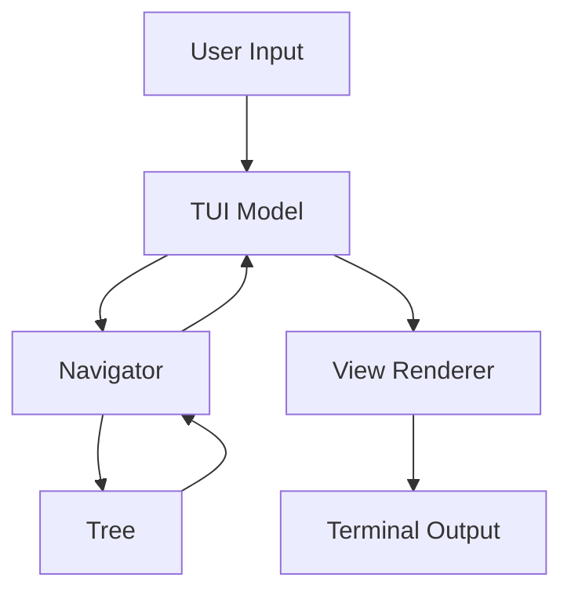

# Documentation Requirements

**Status**: Active

**Last Updated**: 2025-12-27

## Overview

This document defines documentation requirements for the TerraX project. Good documentation is essential for maintainability, onboarding, and long-term project health.

## Documentation Layers

TerraX documentation exists at multiple levels:

1. **Code Documentation**: Comments, godoc, inline explanations.
2. **Project Documentation**: README, CLAUDE.md, user guides.
3. **Architecture Documentation**: ADRs, design docs, diagrams.
4. **Standards Documentation**: Coding standards, conventions, processes.
5. **Knowledge Base**: Pitfalls, lessons learned, troubleshooting.

## Code Documentation (MANDATORY)

### Package Documentation

**Requirement**: Every package must have package-level documentation.

**Location**: First file in package (typically file with same name as package).

**Format**:

```go
// Package stack provides tree building and navigation for Terragrunt stacks.
//
// The package implements core business logic for TerraX, including filesystem
// scanning, tree construction, and hierarchical navigation operations.
// It is designed to be UI-agnostic and testable without framework dependencies.
//
// # Architecture
//
// The package follows the Navigator pattern, separating tree structure (Node)
// from navigation operations (Navigator). This allows business logic to be
// tested independently of UI frameworks.
//
// # Usage
//
//   root, err := stack.BuildTree("/path/to/terragrunt")
//   if err != nil {
//       log.Fatal(err)
//   }
//
//   nav := stack.NewNavigator(root, 5)
//   state := &NavigationState{SelectedIndices: []int{0}}
//   children := nav.GetChildrenAtDepth(state, 0)
package stack
```

**Sections** (optional but recommended):
- **Overview**: Brief description (1-2 sentences).
- **Architecture**: Design patterns and structure.
- **Usage**: Example code showing basic usage.
- **Notes**: Important caveats or requirements.

### Exported Declarations

**Requirement**: All exported types, functions, methods, constants, and variables must be documented.

**Format**: Start with declaration name, followed by description.

```go
// Navigator provides tree navigation operations for Terragrunt stacks.
// It encapsulates business logic for traversal, selection propagation,
// and breadcrumb generation without UI dependencies.
type Navigator struct {
    root     *Node
    maxDepth int
}

// NewNavigator creates a Navigator for the given tree root and maximum depth.
// The maxDepth parameter limits how many levels deep navigation can go,
// preventing performance issues with extremely deep directory structures.
//
// Returns nil if root is nil.
func NewNavigator(root *Node, maxDepth int) *Navigator {
    if root == nil {
        return nil
    }
    return &Navigator{
        root:     root,
        maxDepth: maxDepth,
    }
}

// MaxDepth is the default maximum tree depth for navigation.
// Depths beyond this limit are typically ignored for performance.
const MaxDepth = 20
```

### Internal Documentation

**Requirement**: Document complex logic, edge cases, and non-obvious decisions.

**When to document internally**:
- Complex algorithms or logic.
- Edge case handling.
- Performance optimizations.
- Workarounds or hacks.
- Non-obvious invariants.

**Example**:

```go
func (n *Navigator) PropagateSelection(state *NavigationState, depth int) {
    // Truncate selections beyond changed depth.
    // When selection changes at level N, all selections at levels N+1 and deeper
    // become invalid because the children lists have changed. We reset them to
    // avoid index-out-of-bounds errors when navigating.
    state.SelectedIndices = state.SelectedIndices[:depth+1]

    // Reset deeper selections to first child (index 0).
    for i := depth + 1; i < len(state.SelectedIndices); i++ {
        state.SelectedIndices[i] = 0
    }
}
```

### Comment Standards

See [Comment Guidelines](comment-guidelines.md) for detailed comment standards.

**Quick rules**:
- All comments end with periods.
- Explain WHY, not WHAT.
- Update, don't delete.
- Document edge cases.

## Project Documentation

### README.md (MANDATORY)

**Location**: Root directory (`/README.md`).

**Purpose**: User-facing documentation for installation, usage, and features.

**Required sections**:

```markdown
# TerraX

Brief tagline describing the project.

## Overview

What is TerraX? What problem does it solve?

## Features

- Feature 1
- Feature 2
- Feature 3

## Installation

### Prerequisites

- Go 1.25+
- Make (optional)

### Build from Source

```bash
git clone https://github.com/israoo/terrax.git
cd terrax
make build
```

### Install via Go

```bash
go install github.com/israoo/terrax@latest
```

## Usage

```bash
# Basic usage
terrax /path/to/terragrunt/stack

# With options
terrax --max-depth 10 /path/to/stack
```

## Configuration

How to configure TerraX (if applicable).

## Development

See [CLAUDE.md](CLAUDE.md) for development guide.

## Contributing

Guidelines for contributions.

## License

License information.

## Support

Where to get help.
```

**Style**:
- User-focused (not developer-focused).
- Clear and concise.
- Include screenshots or GIFs if helpful.
- Keep up-to-date with features.

### CLAUDE.md (MANDATORY)

**Location**: Root directory (`/CLAUDE.md`).

**Purpose**: Guide for developers (human and AI) working on TerraX.

**Required sections**:

```markdown
# CLAUDE.md

Guidance for Claude Code when working with this repository.

## Project Overview

What is TerraX? Tech stack, architecture summary.

## Essential Commands

```bash
make build
make run
make test
```

## Architecture

High-level architecture overview, key patterns.

## Architectural Patterns (MANDATORY)

Critical patterns that must be followed:
- Bubble Tea Architecture
- Navigator Pattern
- Separation of Concerns
- Sliding Window Navigation

## Code Patterns & Conventions

- Comment style
- Import organization
- File organization
- Error handling

## Testing Strategy

What to test, how to test, coverage goals.

## Development Workflow

Before coding, while coding, before committing.

## Common Tasks

Adding features, modifying UI, debugging.

## Critical Requirements

Cross-platform, error handling, performance, git workflow.

## Development Environment

Prerequisites, tools, build process.

## Key Principles Summary

Top 10 principles for the project.
```

**Style**:
- Developer-focused.
- Prescriptive (HOW to do things).
- Include code examples.
- Reference detailed docs (ADRs, standards).

### CHANGELOG.md (Recommended)

**Location**: Root directory (`/CHANGELOG.md`).

**Purpose**: Track notable changes between versions.

**Format**: [Keep a Changelog](https://keepachangelog.com/)

```markdown
# Changelog

All notable changes to TerraX will be documented in this file.

The format is based on [Keep a Changelog](https://keepachangelog.com/),
and this project adheres to [Semantic Versioning](https://semver.org/).

## [Unreleased]

### Added
- New feature descriptions

### Changed
- Changes to existing features

### Fixed
- Bug fixes

### Deprecated
- Features marked for removal

### Removed
- Removed features

### Security
- Security fixes

## [0.2.0] - 2025-01-15

### Added
- Sliding window navigation for deep hierarchies
- Layout calculator for dynamic column display

### Changed
- Refactored rendering to use Renderer pattern

### Fixed
- Fixed breadcrumb generation for empty trees

## [0.1.0] - 2025-01-01

### Added
- Initial release
- Basic tree navigation
- Bubble Tea TUI
```

## Architecture Documentation

### Architecture Decision Records (ADRs)

**Location**: `/docs/adr/`

**Requirement**: Create ADR for significant architectural decisions.

**When to create**:
- Choosing frameworks or libraries.
- Establishing architectural patterns.
- Making trade-offs with long-term impact.
- Decisions that affect multiple components.

**Format**: See [ADR README](../adr/README.md)

**Example ADRs**:
- ADR-0001: Bubble Tea Architecture
- ADR-0002: Navigator Pattern
- ADR-0003: Sliding Window Navigation
- ADR-0004: Separation of Concerns

### Design Documents

**Location**: `/docs/design/` (create if needed)

**Purpose**: Document complex features before implementation.

**When to create**:
- Major new features.
- Significant refactoring.
- Complex integrations.

**Format**:

```markdown
# Design: Feature Name

**Author**: Your Name
**Date**: 2025-XX-XX
**Status**: [Draft | Review | Approved | Implemented]

## Problem

What problem are we solving?

## Goals

- Goal 1
- Goal 2

## Non-Goals

- What we're explicitly not doing

## Proposed Solution

### Overview

High-level description.

### Architecture

Architecture diagram or description.

### Components

#### Component 1

Description, responsibilities, interfaces.

#### Component 2

...

### Data Flow

How data moves through the system.

### API Design

Public interfaces, function signatures.

## Alternatives Considered

### Alternative 1

Why it was rejected.

## Implementation Plan

1. Step 1
2. Step 2
3. Step 3

## Testing Strategy

How to test this feature.

## Rollout Plan

How to deploy/release.

## Success Metrics

How do we measure success?

## Open Questions

- Question 1?
- Question 2?
```

## Standards Documentation

### Coding Standards

**Location**: `/docs/standards/`

**Requirement**: Document coding conventions and best practices.

**Current standards**:
- [Go Coding Standards](go-coding-standards.md)
- [Comment Guidelines](comment-guidelines.md)
- [Error Handling](error-handling.md)
- [Testing Strategy](testing-strategy.md)
- [File Organization](file-organization.md)
- [Documentation Requirements](documentation-requirements.md) (this document)

**When to add standards**:
- Team identifies recurring pattern.
- New technology or pattern introduced.
- Lessons learned from mistakes.

## Knowledge Base Documentation

### Pitfalls

**Location**: `/docs/pitfalls/`

**Requirement**: Document known issues, gotchas, and lessons learned.

**When to document**:
- Bug caused by architectural violation.
- Common mistake identified.
- Subtle issue that's hard to debug.

**Format**: See [Pitfalls README](../pitfalls/README.md)

**Example pitfalls**:
- Mixing Business Logic with UI
- Deleting Helpful Comments
- Platform-Specific Path Handling

### Troubleshooting Guides

**Location**: `/docs/troubleshooting/` (create if needed)

**Purpose**: Help users and developers resolve common issues.

**Format**:

```markdown
# Troubleshooting Guide

## Installation Issues

### Error: "Go version 1.25 required"

**Problem**: Installed Go version is too old.

**Solution**:
1. Install Go 1.25+ from https://go.dev/dl/
2. Verify: `go version`

### Build fails with "package not found"

**Problem**: Go modules not downloaded.

**Solution**:
```bash
go mod tidy
go mod download
```

## Runtime Issues

### TUI doesn't display correctly

**Problem**: Terminal doesn't support required features.

**Solution**:
- Use modern terminal (iTerm2, Windows Terminal, etc.)
- Set TERM environment variable: `export TERM=xterm-256color`

## Performance Issues

### Tree building is slow

**Problem**: Large directory structure.

**Solutions**:
- Use `--max-depth` to limit depth
- Exclude large subdirectories
- Check if filesystem is on network drive
```

## API Documentation (Future)

If TerraX exposes an API or is used as a library:

### Package Documentation

- Use godoc for all public APIs.
- Include examples in godoc comments.
- Provide package-level examples.

### API Reference

**Location**: Generated from godoc.

**Hosting**: https://pkg.go.dev/ (automatic for public repos)

**Manual generation**:

```bash
godoc -http=:6060
# Visit http://localhost:6060/pkg/github.com/israoo/terrax/
```

## Documentation Maintenance

### Review Cycle

- **Weekly**: Update CHANGELOG for new changes.
- **Monthly**: Review and update README for accuracy.
- **Quarterly**: Review ADRs and standards for relevance.
- **Per release**: Update version-specific documentation.
- **Annually**: Comprehensive documentation audit.

### Documentation Updates

When making code changes, update relevant documentation:

**Code changes**:
- [ ] Update code comments if behavior changes.
- [ ] Update godoc if public API changes.
- [ ] Update examples if usage changes.

**Feature additions**:
- [ ] Add to CHANGELOG (Unreleased section).
- [ ] Update README if user-facing.
- [ ] Update CLAUDE.md if affecting development.
- [ ] Create ADR if architecturally significant.

**Bug fixes**:
- [ ] Add to CHANGELOG.
- [ ] Update troubleshooting guide if common issue.
- [ ] Document as pitfall if caused by pattern violation.

### Deprecated Documentation

When deprecating features:

1. **Mark as deprecated** in code:
   ```go
   // DEPRECATED: Use NewFunction instead.
   // This will be removed in v2.0.0.
   func OldFunction() {}
   ```

2. **Update README**: Remove from examples, add migration note.

3. **Add to CHANGELOG**: Document deprecation and removal timeline.

4. **Migration guide**: Explain how to migrate to new approach.

## Documentation Quality Standards

### Clarity

- Use clear, concise language.
- Avoid jargon unless necessary.
- Define technical terms.
- Use examples liberally.

### Completeness

- Cover all user-facing features.
- Document all edge cases.
- Include error messages and solutions.
- Provide context and rationale.

### Accuracy

- Keep documentation in sync with code.
- Test examples to ensure they work.
- Review for outdated information.
- Update version numbers.

### Accessibility

- Use proper heading hierarchy.
- Provide table of contents for long docs.
- Use descriptive link text.
- Include code examples with syntax highlighting.

### Style

- Use active voice ("Run the command" not "The command should be run").
- Use second person ("You can..." not "One can...").
- Use present tense ("The function returns..." not "The function will return...").
- Be consistent with terminology.

## Documentation Tools

### Markdown

All documentation uses [GitHub Flavored Markdown](https://github.github.com/gfm/).

**Tools**:
- [Markdownlint](https://github.com/DavidAnson/markdownlint) for linting.
- [Prettier](https://prettier.io/) for formatting (optional).

### Diagrams

**Tools for architecture diagrams**:
- [Mermaid](https://mermaid.js.org/) - Text-based diagrams in markdown.
- [Draw.io](https://draw.io/) - Visual diagram editor.
- [Excalidraw](https://excalidraw.com/) - Hand-drawn style diagrams.

**Example Mermaid diagram**:

````markdown

````

### Code Examples

- Always test code examples.
- Include necessary imports.
- Show complete, runnable examples when possible.
- Comment complex examples.

```go
// Example: Building and navigating a tree
package main

import (
    "fmt"
    "log"

    "github.com/israoo/terrax/internal/stack"
)

func main() {
    // Build tree from filesystem
    root, err := stack.BuildTree("/path/to/terragrunt")
    if err != nil {
        log.Fatalf("Failed to build tree: %v", err)
    }

    // Create navigator
    nav := stack.NewNavigator(root, 5)

    // Navigate to first child
    state := &stack.NavigationState{
        SelectedIndices: []int{0},
    }

    // Get children at depth 0
    children := nav.GetChildrenAtDepth(state, 0)
    for _, child := range children {
        fmt.Println(child.Name)
    }
}
```

## Documentation Checklist

### For New Features

- [ ] Code comments and godoc added.
- [ ] README updated if user-facing.
- [ ] CLAUDE.md updated if affecting development.
- [ ] CHANGELOG entry added (Unreleased).
- [ ] Examples added/updated.
- [ ] ADR created if architecturally significant.
- [ ] Tests documented.

### For Bug Fixes

- [ ] Code comments updated if behavior changed.
- [ ] CHANGELOG entry added.
- [ ] Troubleshooting guide updated if common issue.
- [ ] Pitfall documented if pattern violation.

### For Refactoring

- [ ] Code comments updated.
- [ ] CLAUDE.md updated if patterns changed.
- [ ] ADR updated or new ADR created.
- [ ] Migration guide if breaking change.

### For Releases

- [ ] CHANGELOG updated with release version and date.
- [ ] README version numbers updated.
- [ ] Documentation builds successfully.
- [ ] All examples tested.
- [ ] Release notes written.

## Related Documentation

- [Comment Guidelines](comment-guidelines.md)
- [Go Coding Standards](go-coding-standards.md)
- [ADR README](../adr/README.md)
- [Standards README](README.md)

## References

- [Go Documentation](https://golang.org/doc/)
- [Writing Good Documentation](https://documentation.divio.com/)
- [Keep a Changelog](https://keepachangelog.com/)
- [Semantic Versioning](https://semver.org/)
- [Architecture Decision Records](https://adr.github.io/)
